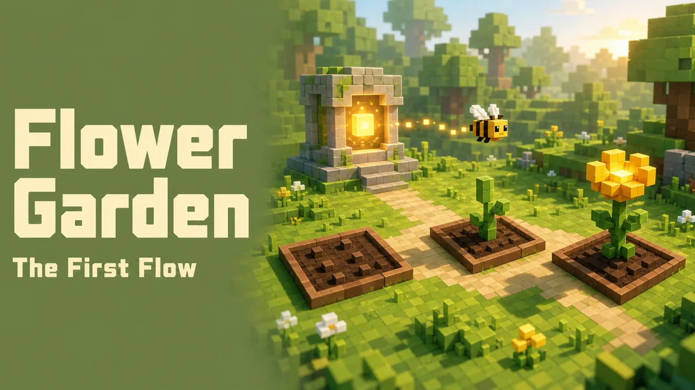

# Flower Garden

**실제 Flower Runtime을 실행하며 배우는 3D 마이크로월드**

Flower Garden은 [Flower](https://github.com/flowerjvm/flower)의 핵심 개념을
작은 3D 게임으로 경험하는 학습 프로젝트입니다. 문서를 먼저 외우는 대신,
플레이어가 결과를 **예측하고**, 실제 Flower에 명령을 보내고, 실행 trace와
3D 세계를 함께 보며 왜 그런 결과가 나왔는지 확인합니다.

> **English:** Flower Garden is a collection of playful 3D microworlds for
> learning Flower through prediction, real runtime execution, observation, and
> source-backed evidence.

<table>
  <tr>
    <td width="50%">
      
    </td>
    <td width="50%">
      
    </td>
  </tr>
  <tr>
    <td><strong>01 · First Bloom Meadow</strong><br />Flower 실행의 가장 작은 핵심부터 시작합니다.</td>
    <td><strong>02 · Verdant Signal Garden</strong><br />Signal과 Timeout의 경쟁을 직접 실험합니다.</td>
  </tr>
</table>

## 왜 Flower Garden인가요?

Flower의 생태계가 커질수록 처음 배우는 사람은 `Engine`, `Worker`, `Flow`,
`Step`, `Signal`, `Timeout`, `Checkpoint` 같은 용어를 한꺼번에 만나게
됩니다. Flower Garden은 이 인식 부채를 줄이기 위해 한 월드에서 한 가지
실행 계약만 다룹니다.

```text
예측
  ↓
플레이어 명령
  ↓
실제 Flower 실행
  ↓
Runtime trace 관찰
  ↓
3D 세계에서 결과 확인
  ↓
관련 상태 전이 · 소스 · 테스트로 설명
```

이 프로젝트의 가장 중요한 원칙은 다음과 같습니다.

```text
실제 Flower Runtime
        ↓
실행 이벤트 · 상태 변경 기록
        ↓
World Projection
        ↓
3D 게임 세계
```

이 프로젝트에서 **Flow 상태, 현재 Step, StepResult와 최종 실행 결과에 대한
유일한 권위는 실제 Flower Runtime입니다.** 브라우저와 3D 장면은 Step 전이,
승리 경로 또는 최종 상태를 계산하지 않습니다. 실제 Flower가 만든 trace를
학습자가 이해할 수 있는 세계로 투영할 뿐입니다.

자세한 결정 근거는
[ADR-0001](docs/adr/0001-runtime-authoritative-world-projection.md), 실행
계약은 [contracts/README.md](contracts/README.md)에서 확인할 수 있습니다.

## 가장 쉽게 실행하기

공통으로 필요한 프로그램:

- Node.js `22.13` 이상
- JDK `17` 이상

Maven은 별도로 설치하지 않아도 됩니다. 최초 실행에는 npm/Maven 의존성을
받기 위한 인터넷 연결이 필요하며, 로컬 포트 `3000`과 `8080`을 사용합니다.

### Windows

1. 이 저장소를 내려받거나 clone합니다.
2. 저장소 루트의 **`PLAY.cmd`를 더블클릭**합니다.
3. 브라우저에서 원하는 월드를 선택합니다.
4. 플레이가 끝나면 런처 창에서 Enter를 눌러 종료합니다.

```powershell
git clone https://github.com/flowerjvm/flower-garden.git
cd flower-garden
.\PLAY.cmd
```

첫 실행에서는 웹 의존성과 Maven Wrapper 배포본을 준비하므로 시간이 조금
더 걸릴 수 있습니다. 그다음부터는 변경된 부분만 다시 빌드합니다.

`PLAY.cmd`가 한 번에 처리하는 작업:

1. 실행 환경 확인
2. 실제 Flower `0.1.1` JVM Runtime 시작
3. 3D 웹 애플리케이션 빌드 및 시작
4. `http://127.0.0.1:3000/` 월드 선택 화면 열기
5. 종료 시 런처가 시작한 프로세스만 정리

### macOS / Linux 또는 개발 모드

터미널 두 개를 사용합니다.

터미널 1:

```bash
SERVER_ADDRESS=127.0.0.1 \
  ./runtime/mvnw -f runtime/pom.xml spring-boot:run
```

터미널 2:

```bash
npm ci
NEXT_PUBLIC_FLOWER_RUNTIME_URL=http://127.0.0.1:8080 \
  npm run dev -- --hostname 127.0.0.1 --port 3000
```

브라우저에서 `http://127.0.0.1:3000/`을 엽니다.

## 플레이 가능한 월드

### 01 · First Bloom Meadow

**Mission: The First Flow**

```text
Engine → Worker → Flow → Step → StepResult
```

네 번의 플레이어 `TICK`이 실제 `Worker.tickOnce()` 네 번으로 이어집니다.

| Tick | 현재 Step | 실제 StepResult | 관찰할 내용 |
| ---: | --- | --- | --- |
| 1 | `prepare-soil` | `STAY` | 현재 Step에 머무릅니다. |
| 2 | `prepare-soil` | `DONE` | 다음 Step으로 전진합니다. |
| 3 | `grow-stem` | `DONE` | 다음 Step은 이후 tick에서 실행됩니다. |
| 4 | `bloom` | `DONE` | Flow가 `FINISHED`가 됩니다. |

이 월드에서는 다음을 배웁니다.

- Engine에 연결된 Worker가 Flow를 실행하는 방식
- 한 번의 Flow tick에서 해당 Flow의 현재 Step은 최대 하나만 실행된다는 계약
- `STAY`와 `DONE`의 차이
- Step 이동과 다음 Step 실행이 서로 다른 tick이라는 경계

### 02 · Verdant Signal Garden

**Mission: Signal vs Timeout**

```text
Event → Signal → StepContext → ManualClock → StepResult
```

플레이어가 실제 `ManualClock`과 Signal 입력을 바꾼 뒤, 다음 Worker tick의
결과를 예측합니다.

| Scenario | 결정 tick 이전의 사실 | 실제 정책과 결과 |
| --- | --- | --- |
| Signal at 29s | Signal=true, Timeout=false | `GOTO yard-move` |
| Timeout at 30s | Signal=false, Timeout=true | `GOTO timed-out` |
| Both at 30s | Signal=true, Timeout=true | `SIGNAL_THEN_TIMEOUT` → `yard-move` |

이 월드에서는 다음을 배웁니다.

- Signal은 Step을 깨우는 힌트이고 전이를 직접 결정하지 않는다는 점
- 시간을 전진시키는 것과 Worker를 tick하는 것이 별도 명령이라는 점
- 둘 이상의 조건이 참일 때 Flow의 명시적 Step 정책이 우선순위를 정한다는 점
- 종료된 Wait는 늦게 도착한 Signal로 다시 열리지 않는다는 점

다음 커리큘럼에는 Checkpoint/Recovery, Worker Stop, Retry/Idempotency,
장애 대응, 시각적 Flow 설계 월드를 계획하고 있습니다.

전체 학습 순서는 [docs/curriculum.md](docs/curriculum.md)에 정리되어 있습니다.

## LIVE Runtime과 Recorded Replay

로컬에서 `PLAY.cmd`를 사용하면 UI가 실제 Flower JVM Runtime과 연결되어
`LIVE`로 표시됩니다.

Runtime Gateway에 연결할 수 없는 환경에서는, 실제 Flower 실행으로 생성하고
테스트로 검증한 canonical trace를 재생할 수 있습니다. 이 경우 UI는
`RECORDED REPLAY`라고 명확히 표시하며, 재생 컨트롤은 기록된 이벤트 사이의
커서만 이동합니다. Replay가 새로운 Flower 결과를 계산하지는 않습니다.

## 월드를 추가하는 방식

월드는 독립된 학습 게임 모듈입니다.

```text
worlds/<world-id>/
├─ world.manifest.json
└─ web/
```

완성된 월드는 [worlds/catalog.ts](worlds/catalog.ts)에 등록되어 월드 선택
화면에 나타납니다. 모든 월드는 하나의 웹 애플리케이션과 공용 Flower Runtime
Gateway를 사용하므로 월드마다 별도 서버를 만들 필요가 없습니다.

현재 구조는 compile-time 등록 방식입니다. 외부 원격 코드를 동적으로
불러오는 플러그인 마켓플레이스는 아직 구현하지 않았습니다.

새 월드는 다음 순서로 완성합니다.

```text
실제 Runtime 동작과 테스트
→ trace 계약과 canonical fixture
→ 순수 World Projection
→ 3D UI
→ manifest · route · catalog 등록
```

## 개발자 안내

### Runtime API

```text
POST /api/v1/worlds/first-bloom-meadow/runs
POST /api/v1/worlds/verdant-signal-garden/runs
POST /api/v1/runs/{runId}/commands
```

명령에는 고유한 `commandId`, URL과 동일한 `runId`, 최신
`expectedSequence`가 들어갑니다. 응답의 `events`는 delta가 아니라
sequence 1부터 최신 이벤트까지의 누적 trace입니다.

| Command | Payload | 실제 효과 |
| --- | --- | --- |
| `TICK` | `{}` | 해당 미션 Worker의 `tickOnce()`를 정확히 한 번 호출 |
| `ADVANCE_TIME` | `{"millis": 1..300000}` | Verdant의 실제 `ManualClock`만 전진 |
| `SEND_SIGNAL` | `{"name":"yard-assignment"}` | Verdant가 구독한 실제 미션 event 발행 |

같은 전체 명령을 동일한 `commandId`로 재전송하면 원래 응답을 반환하고 명령을
두 번 적용하지 않습니다. 같은 ID를 다른 내용으로 재사용하면 거부합니다.

### 프로젝트 구조

```text
app/                         웹 애플리케이션과 월드 선택 화면
contracts/                   JSON Schema와 검증된 runtime trace
docs/                        커리큘럼과 Architecture Decision Record
runtime/                     Java 17 Spring Boot Flower Runtime Gateway
web/                         공용 runtime client와 projection
worlds/
  first-bloom-meadow/        첫 번째 월드 manifest와 3D UI
  verdant-signal-garden/     두 번째 월드 manifest와 3D UI
```

### 검증

Windows:

```powershell
.\runtime\mvnw.cmd -f runtime\pom.xml test
npm run lint
npm run fixtures:verdant:check
npm test
npm run play:smoke
```

macOS / Linux:

```bash
./runtime/mvnw -f runtime/pom.xml test
npm run lint
npm run fixtures:verdant:check
npm test
```

Runtime 테스트는 실제 Flower 실행으로 First Bloom의 네 tick과 Verdant의
세 Signal/Timeout 시나리오를 검증합니다. 테스트에는 고정 sleep을 사용하지
않습니다.

## 현재 범위

Flower Garden은 아직 초기 학습 월드를 확장하는 단계입니다. 현재 다음 기능은
의도적으로 포함하지 않았습니다.

현재 버전은 교육용 초기 프로젝트입니다. Run과 trace는 메모리에 보관되어
Runtime을 재시작하면 사라지며, 운영용 workflow 서비스가 아닙니다.

- 데이터베이스 기반 durable trace journal
- Checkpoint, Retry, failure injection, Worker stop 게임 조작
- SSE reconnect와 다중 replica routing
- 동적 또는 원격 world plugin loader

각 기능은 그 계약을 실제로 가르치는 플레이 가능한 월드가 생길 때 함께
추가합니다.

## 라이선스

Flower Garden은 [Apache License 2.0](LICENSE)으로 공개됩니다.
저작권과 고지 사항은 [NOTICE](NOTICE)를 확인하세요.
